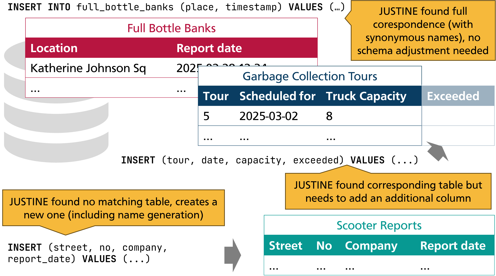

# JUSTINE (JUST-INsert Engine): Demonstrating Self-organizing Data Schemas

Benjamin Hättasch, Leon Krüger & Carsten Binnig

Demo at VLDB'25: [Read the paper](https://vldb.org/pvldb/volumes/18/paper/JUSTINE%20(JUST-INsert%20Engine)%3A%20Demonstrating%20Self-organizing%20Data%20Schemas)

Relational databases are great for data analysis and exploration, but require a carefully crafted schema, which causes high manual overhead. Moreover, entities not considered during schema design cannot be stored. In contrast, schemaless approaches allow users to store all kinds of data without the need for a schema, but require schema-checking on read to ensure that queries can read certain attributes. We therefore advocate for a new class of database systems that organize the data in a schema autonomously when it is inserted schemalessly by users. Such databases should thus be able to store data semantically meaningful but without requiring the user to design a schema, neither upfront during setup nor when an insert is executed. In this demo, we showcase JUSTINE, which is a first implementation of this new class of database systems that can automatically adjust a database schema based on input queries. Our showcase features both (1) an interactive mode where attendees can enter their own data as well as (2) the execution of a full workload where users can see how the database schema evolves during batch execution. The workload can be customized by changing different parameters.

Please [watch our demo video to learn more](https://link.tuda.systems/JUSTINE-video). 



## How to cite

```
Benjamin Hättasch, Leon Krüger, and Carsten Binnig. JUSTINE (JUST-INsert Engine): Demonstrating Self-organizing Data Schemas.
PVLDB, 18(12): 5283 - 5286, 2025.
doi:10.14778/3750601.3750652
```

## How to use

### Frontend

```sh
npm install
npm start
```
### Backend

```sh
pip install -r requirements.txt
fastapi dev main.py
```
